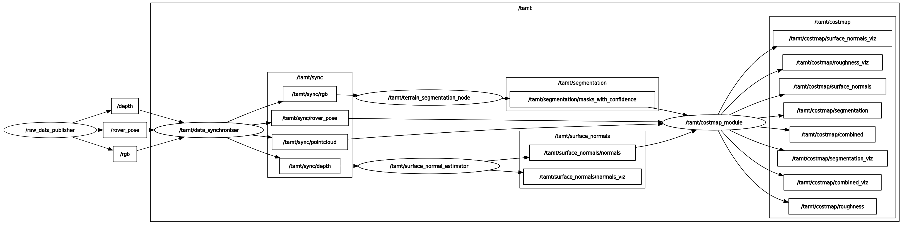

# TAMT - Traversability Assessment of Martian Terrain

A ROS2 package for real-time traversability analysis using RGB-D camera data and rover pose information.

## Quick Start

1. **Clone the repository**
```bash
cd ~
git clone git@github.com:MagnusDaroe/TAMT-Traversability-Assessment-of-Martian-Terrain.git tamt
cd tamt
```

2. **Setup environment**
```bash
./setup_venv.sh
./setup_env.sh
```

3. **Build and source**
```bash
colcon build
source install/setup.bash
```

4. **Launch**
```bash
ros2 launch cost_module tamt.launch.py
```

5. **Manual trigger** (optional if `auto_fetch_enabled` is false)
```bash
ros2 service call tamt/trigger_sync interfaces/srv/TriggerSync
```

## System Overview

### Inputs
- RGB image (camera feed)
- Rover pose (position and orientation)
- Depth image (aligned with camera frame)

### Outputs
The system generates traversability costmaps visualizable in RViz2:
- **Roughness Costmap** - terrain irregularity analysis
- **Segmentation Costmap** - terrain classification based risk
- **Surface Normal Costmap** - slope and orientation analysis
- **Combined Costmap** - weighted fusion of all layers (always published)



## Configuration

All parameters are configured in `cost_module/config/params.yaml`.

### Synchronization
- **Timeout**: Maximum wait time for sensor data synchronization before error

### Camera Configuration
- **Mounting**: Tilt angle, height above ground, static transform (rover → camera)
- **Optics**: Horizontal/vertical FOV, maximum sensing range
- **Intrinsics**: Focal lengths (fx, fy), principal point (cx, cy)
- **Resolution**: Image width and height

### Segmentation Model
- **Model**: Path to trained model file, computation device (GPU/CPU)
- **Inference**: Confidence threshold, IoU threshold for NMS, input image size, max detections
- **Output**: Verbosity, save options for results and confidence scores

### Costmap Settings
- **Auto-fetch**: Automatically request new sensor data after processing completes
- **Resolution**: Internal processing resolution vs. output resolution
- **Publishing**: Control individual layer and visualization outputs
- **Weights**: Relative importance of each layer (must sum to 1.0)
  - Surface normal estimation weight
  - Segmentation weight
  - Roughness weight

### Segmentation Costmap
- **Class risks**: Risk values for terrain types (soil, bedrock, sand, rocks, holes)
- **Dilation**: Enable/disable boundary expansion, kernel size, minimum confidence threshold
- **Confidence dampening**: Factor controlling how confidence affects final cost values (0.0-1.0)
