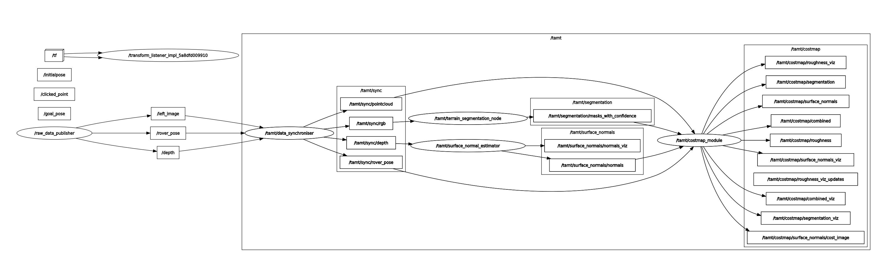

# TAMT-Traversability-Assessment-of-Martian-Terrain

python3 /home/spacerob/tamt/src/terrain_segmentation/scripts/view_yolo_annotations.py /home/spacerob/tamt/dataset/tamt.v2-ai4mars_relabelled_03_12_2025_txt
# TODO
Make launch file(transform to camera, 2 sync nodes, SNE node, and cost node)
Save rviz2 config file


# Nice commands
ros2 run tf2_ros static_transform_publisher 1.709320068 -4.636882782 0.800000012 -0.174203563 0.681054306 0.70024741 -0.124385352 map zed2i_left_camera_optical_frame


# This is a dividing line

Welcome to the TAMT(Traversability-Assessment-of-Martian-Terrain) ROS2 workspace. This repository contains XX components:
- ROS2 Setup
- Semantic Segmentation model
- Surface normal Estimation model 
- Costmap module

# Environment Setup
1. Clone the repository
```bash
cd ~
git clone git clone git@github.com:MagnusDaroe/TAMT-Traversability-Assessment-of-Martian-Terrain.git tamt
cd tamt
```

2. Setup virtual environment and dependencies
```bash
./setup_venv.sh
./setup_env.sh
```

3. Build the workspace
```bash
colcon build
source install/setup.bash
```

6. Launch the costmap module
```bash
ros2 launch cost_module costmap.launch.py
```

7. call the server to publish (temporary)
```bash
ros2 service call tamt/trigger_sync sync_pkg/srv/TriggerSync
```

# System Inputs and Outputs Overview

##  System Inputs
The system processes the following incoming data streams:

- **RGB image** — camera input  
- **Rover pose** — position and orientation of the rover  
- **Depth image** — depth information aligned with the camera frame  

---

##  System Outputs
The following costmap layers are generated and can be visualized in **RViz2**:

- **Roughness Costmap** 
- **Segmentation Costmap**  
- **Surface Normal Costmap**  
- **Combined Costmap** — final weighted fusion of all layers  




# Configuration Overview

This section summarizes the key parameters used in the system, grouped by their functional categories.  
All values are taken directly from the cost_module's YAML configuration files.

---

##  Camera Parameters

| Parameter | Value | Description |
|----------|--------|-------------|
| `tilt_angle` | 20.0° | Camera tilt angle relative to the horizontal plane |
| `fov_x` | 110.0° | Horizontal field of view |
| `fov_y` | 70.0° | Vertical field of view |
| `max_distance` | 2.5 m | Maximum sensing range |
| `height` | 0.43 m | Camera height above ground |

---

##  Image Resolution

| Parameter | Value | Description |
|----------|--------|-------------|
| `width` | 960 px | Image width |
| `height` | 540 px | Image height |

---

##  Camera Intrinsics

| Parameter | Value | Description |
|----------|--------|-------------|
| `fx` | 685.51 | Focal length (x-axis) |
| `fy` | 189.06 | Focal length (y-axis) |
| `cx` | 480.00 | Principal point x-coordinate |
| `cy` | 270.00 | Principal point y-coordinate |

---

##  Static Transform (Rover → Camera)

### Translation (meters)

| x | y | z |
|---|---|---|
| 0.157499 | 0.059899 | 0.238857 |

### Rotation (quaternion)

| x | y | z | w |
|---|---|---|---|
| 0.5 | -0.5 | -0.5 | 0.5 |

---

##  Rover Parameters

| Parameter | Value | Description |
|----------|--------|-------------|
| `width` | 1.0 m | Rover width |
| `length` | 1.2 m | Rover length |

---

##  Costmap Parameters

| Parameter | Value | Description |
|----------|--------|-------------|
| `publish_individual_layers` | true | Publish each costmap layer separately |
| `publish_visualizations` | true | Enable visualization topics |
| `internal_resolution` | 0.01 m | Internal processing resolution |
| `output_resolution` | 0.05 m | Output costmap resolution |

### Costmap Weights (must sum to 1.0)

| Layer | Weight |
|-------|--------|
| `weight_sne` | 0.4 |
| `weight_segmentation` | 0.3 |
| `weight_roughness` | 0.3 |

### Segmentation Settings

| Parameter | Value |
|----------|--------|
| `dilation_enabled` | true |
| `dilation_kernel_size` | 3 |
| `dilation_min_confidence` | 0.7 |

---

##  Class Risk Values

| Class | Risk |
|--------|------|
| soil | 0.2 |
| bedrock | 0.1 |
| sand | 0.3 |
| rocks | 0.9 |
| hole | 1.0 |

---


